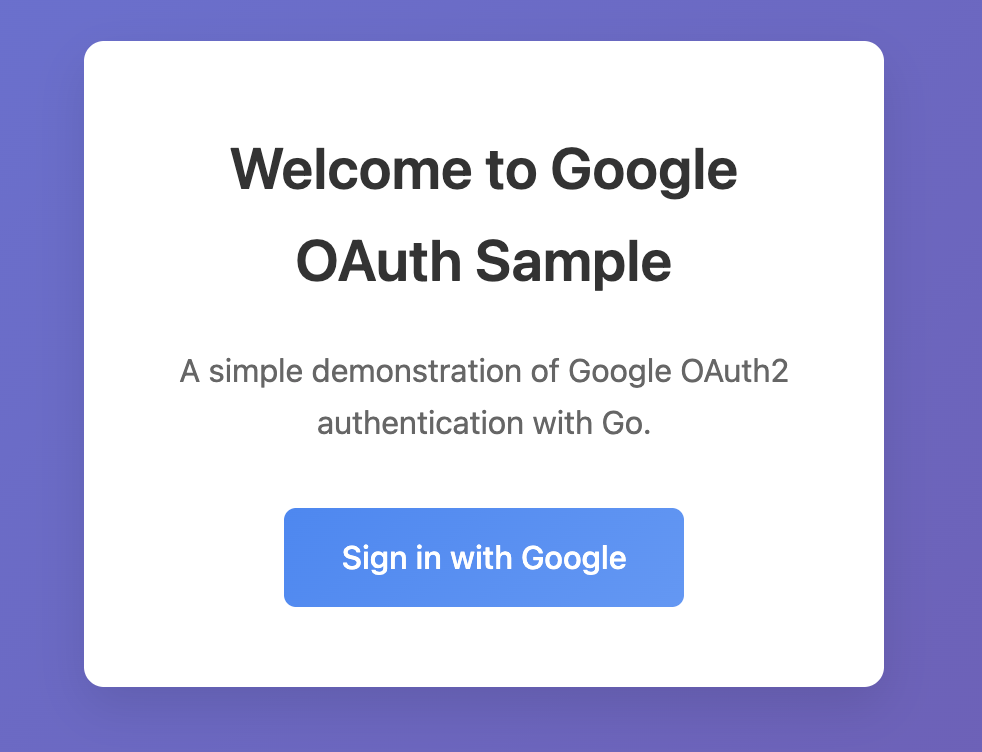
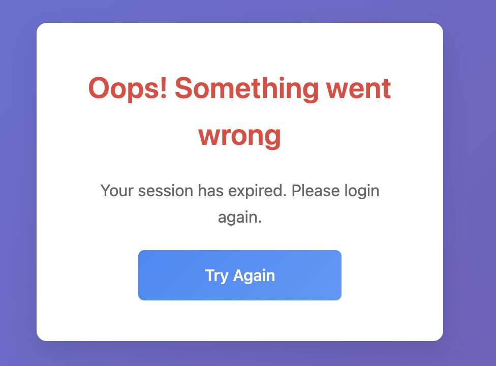
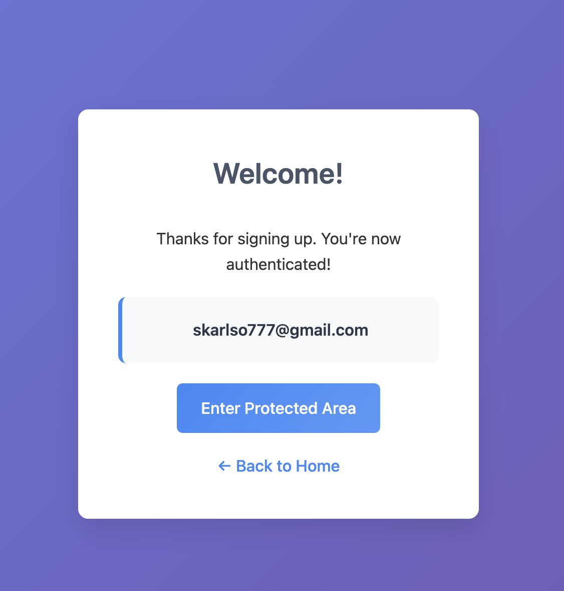
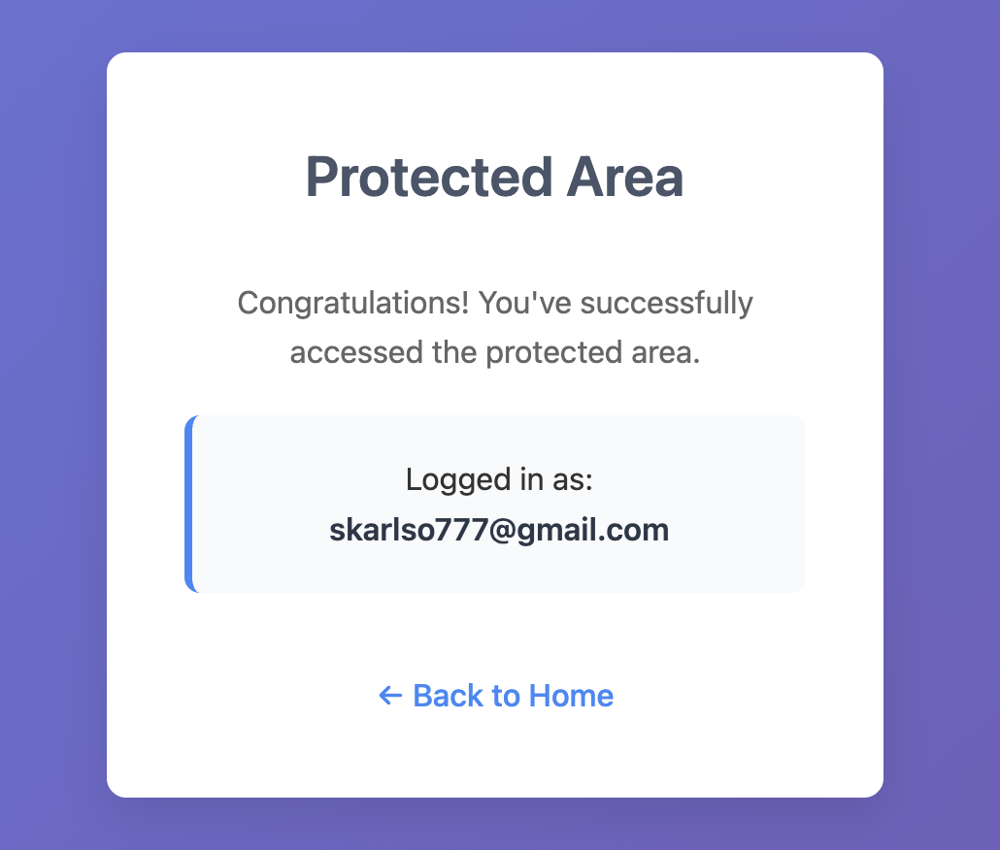
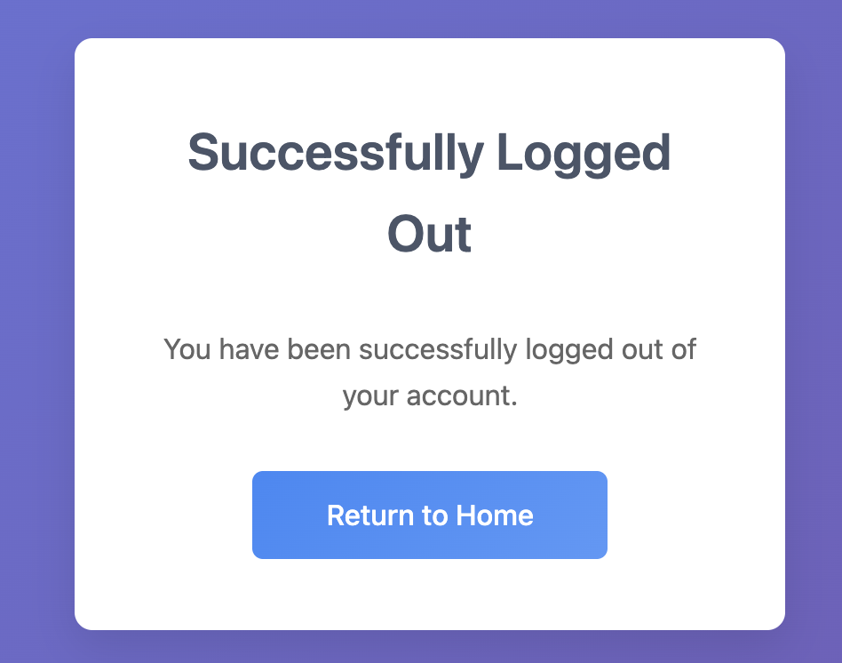

# Google OAuth Go Sample

## Installation

```bash
git clone https://github.com/Skarlso/google-oauth-go-sample
cd google-oauth-go-sample
go mod download
```

## Setup

## Google

In order for the Google Authentication to work, you'll need developer credentials which this application gathers from a file in the root directory called `creds.json`. The structure of this file should be like this:

```json
{
  "installed": {
    "client_id": "hash.apps.googleusercontent.com",
    "project_id": "random",
    "auth_uri": "https://accounts.google.com/o/oauth2/auth",
    "token_uri": "https://oauth2.googleapis.com/token",
    "auth_provider_x509_cert_url": "https://www.googleapis.com/oauth2/v1/certs",
    "client_secret": "secret",
    "redirect_uris": [
      "http://localhost"
    ]
  }
}
```

To get these credentials:

1. Go to the [Google Cloud Console](https://console.cloud.google.com/)
2. Create a new project or select an existing one
3. Enable the Google+ API
4. Go to "Credentials" → "Create Credentials" → "OAuth 2.0 Client ID"
5. Choose "Web application" as the application type
6. Add `http://127.0.0.1:9090/auth` to "Authorized redirect URIs"
7. Download the credentials as `creds.json` and place it in the project root

**Note:**: The application uses a FIXED session key for development. In production, set a secure 32-byte session key via environment variable or configuration.

## Running

```bash
# Build the application
go build .

# Run the server
./google-oauth-go-sample
```

Then navigate to http://127.0.0.1:9090 in your browser.

The protected area is `/battle/field`.

# Showcase





